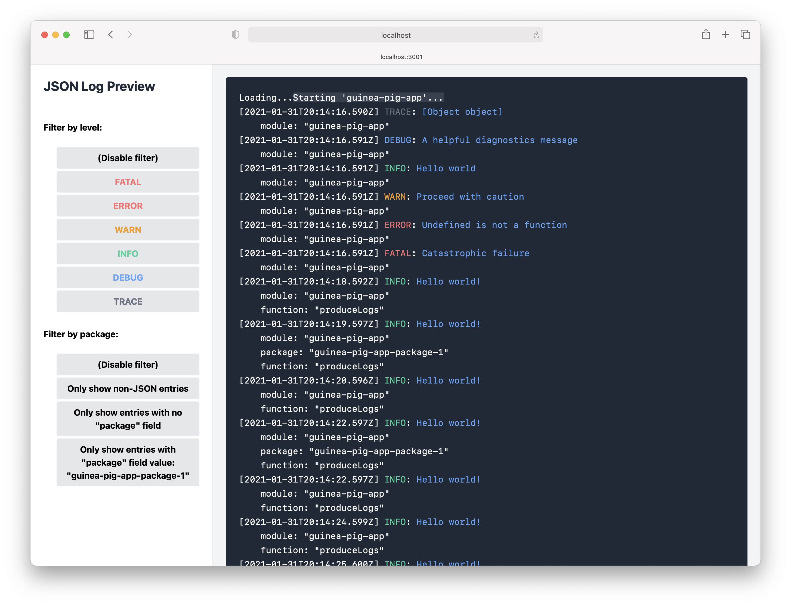

# json-log-preview

_Note: This is experimental software and has not been extensively tested in production environments!_

This is a utility web app for near-real-time previewing of structured JSON logs.
It is currently designed to consume output from applications which use the
[pino](https://github.com/pinojs/pino) library, but support for arbitrary structured
JSON log formats is planned.



The utility runs on Node.js, and uses websockets to stream log information to a locally running web interface.

## Usage

Install dependencies with yarn:

```console
$ yarn install
```

Run this app with Node.js using the `start` package script (installing as a
package / bin is not yet supported). This app consumes input from the stdin
stream, so setup a pipe for the log-producing app (or `cat` if your logs are in
a file). This codebase includes a simple logger app for demonstration purposes,
and both can be launched with the following example command:

```console
yarn run start:dev:guinea-pig-app | yarn run start
```

By default, the app will be served at [http://localhost:3001](http://localhost:3001). This can be modified by specifying the `PORT` environment variable.

Using the sidebar controls, you can filter the log entry view by log level, or by the `package` field of JSON objects.

As long as you remain scrolled to the bottom of the log panel, the view will auto-follow
to scroll down to new log entries as they appear.

For convenience, this app also forwards stdin to stdout, you can also see all log entries in your terminal in addition to the web interface. You can also pipe them to other utilities.

## Some planned features

[ ] Support for arbitrary JSON log formats (field names, loglevels etc.)
[ ] Binary usage support with `npm`
[x] Performance improvements (heavy logging will eventually result in huge DOM and slow down this experimental version of the app, so don't forget to shut it down after use!)
[ ] Graceful handling of app shutdown
[ ] Improved JSON field discovery for setting filters
[ ] Support for `jq`-style syntax for filter expressions
[ ] Hide log entry details behind modal view by default
[ ] Automatic test suite
[x] Optional page auto-scroll
