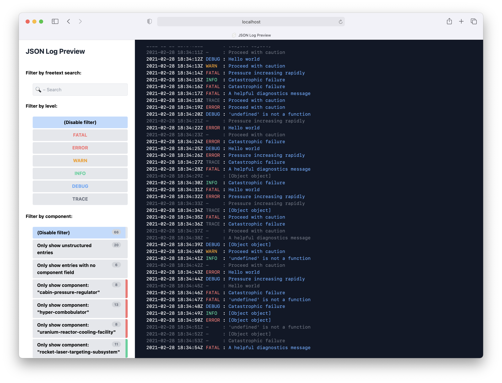
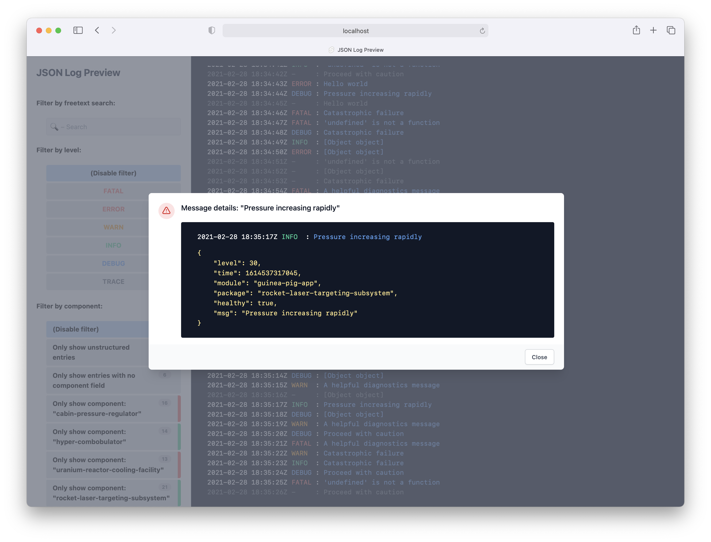

# json-log-preview

_Note: This is experimental software and has not been extensively tested in production environments!_

This is a utility web app for near-real-time previewing of structured JSON logs.
It is currently designed to consume output from applications which use the
[pino](https://github.com/pinojs/pino) library, but support for arbitrary structured
JSON log formats is planned.

_Screenshot – Log overview panel:_



_Screenshot – Log entry details view:_



The utility runs on Node.js, and uses websockets to stream log information to a locally running web interface.

## Installation (WIP)

Publishing this package is currently work-in-progress. In the meanwhile, you can install the package directly from GitHub.

### Using NPM

```shell
npm install --global "git://github.com/aarokorhonen/json-log-preview#release/latest-experimental"
```

### Using Yarn

```shell
yarn global remove @aarokorhonen/json-log-preview
```

## Usage

This app provides a CLI command called `json-log-preview` which consumes input from the stdin stream, so setup a pipe for the log-producing app (use`cat`or`tail -f` if your logs are in a file).

By default, the app will be served at [http://localhost:3001](http://localhost:3001). This can be modified by specifying the `PORT` environment variable.

Using the sidebar controls, you can filter the log entry view by log level, or by the `package` field of JSON objects.

As long as you remain scrolled to the bottom of the log panel, the view will auto-follow
to scroll down to new log entries as they appear.

For convenience, this app also forwards stdin to stdout, you can also see all log entries in your terminal in addition to the web interface. You can also pipe them to other utilities.
